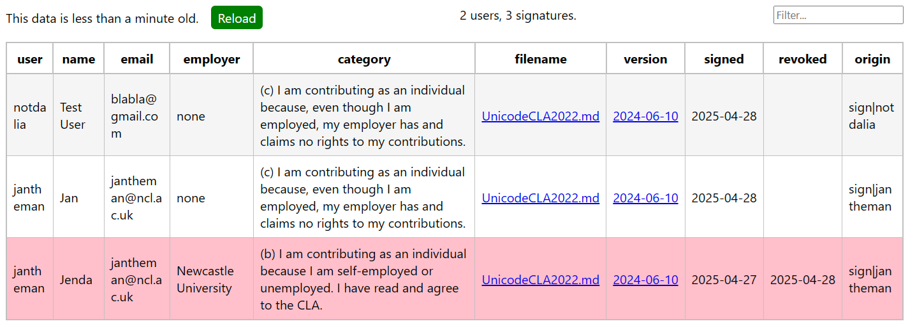

# CLA-dwight

A proxy to https://github.com/cla-assistant/cla-assistant API for checking CLA signatures within an organization. The CLA assistant requires a GitHub personal access token with `admin:org` rights. The purpose of this service is to allow checking CLA status of contributors without having to hand out an organizational admin token to staff (instead, it is must be provided as an environmental variable). The data from CLA assistant is cached and needs to be explicitly reloaded.

Built using Node.js, Express 5 and pug.

## API endpoints

| API endpoint | Description |
| -- | -- |
| `/list` :arrows_counterclockwise: | Returns a list of all signatures of all users (as _html_, _json_ or _xml_). :old_key: This call can optionally be password-protected (see `CLA_LIST_AUTH`).
| `/list/username` :arrows_counterclockwise: | Checks whether a given GitHub username has a currently valid license signature. `404` no signature, `200` valid signature exists, `410` signature revoked If the request asks for _json_ or _xml_, it will receive list of all signatures by the specific user in a `200` response. Note that even if `/list` API is password protected, this API remains open (although individual fields can be filtered out, see `CLA_AUTH_FIELDS`).
| `/reload` | Loads the most recent data from the CLA assistant into cache, returns `200 OK` or `500 ERROR`. This has the same effect as the `?reload=true` parameter (see note below).
| `/status` | Returns `200 OK` unless the service is misconfigured (i.e. missing `GITHUB_ORG` or `GITHUB_ORGTOKEN`) or the initial data request to the CLA assistant fails, in which case it returns `503` with an appropriate error message. When in error state, requests to `/list` and `/list/username` will fail with `503`. The `/reload` endpoint remains accessible and can be used to try to repeat the data request.

:arrows_counterclockwise: Add the `?reload=true` parameter to force using the most recent data.

## Environmental variables

| Variable | Default | Description
|--|--|--|
| `PORT`    | `3000`    | Web server port
| `TIMEOUT` | `30000`   | Timeout for CLA assistant calls (in milliseconds)
| `BASE`    | `/`       | URL prefix to serve (e.g. `/cla` would serve `example.com/cla/list`)
| `CLA_ASSISTANT_URL`   | `https://cla-assistant.io/` | Base URI for the CLA assistant 
| `CLA_LIST_AUTH` |     | If present, the `/list` endpoint will require basic HTTP authorization (the browser will ask for username and password). The value should be space-separated base64-encoded `username:password` values. For example, to require login and allow user _test_ with password _123_, you would set this to `dGVzdDoxMjM=`
| `CLA_AUTH_FIELDS` |  | If present, the `/list/username` endpoint will remove specified fields from `custom_fields`, unless the client sends basic HTTP authorization header (without challenge). The value should be space-separated names of the fields. Same authorization of `CLA_LIST_AUTH` applies.
| `CLA_FILECACHE` |     | Directory path where to store responses from CLA assistant as files. If present, the file data will be used when the call to the CLA assistant fails (unless reload is explicitly requested).
| `GITHUB_ORGID` | **required** | GitHub organization ID. This is a number that can be obtained from  `https://api.github.com/orgs/{organization username}` (the `"id"` attribute). 
| `GITHUB_ORGTOKEN` | **required** | PAT token with `admin:org` access to the GitHub organization for which to check signatures.

See [.example.env](.example.env) for an environmental file sample.

## Example output of /list in browser

